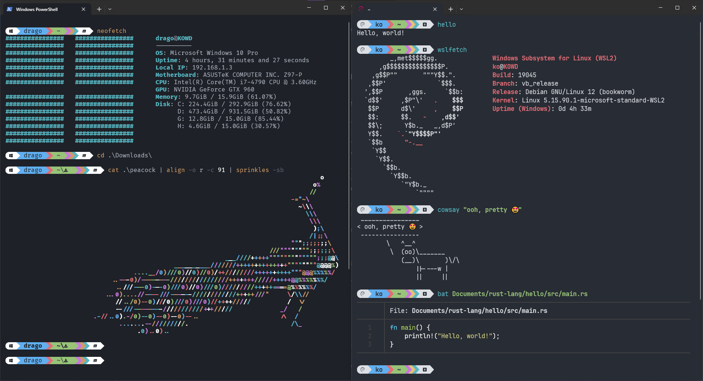

<h1 align="center">🐚 Shells and Whistles 🥳</h1>

<h3 align="center">Starship | PowerShell + Nushell | Windows Terminal</h3>

<p align="center">
  
</p>

## 🔤 A couple of themes & fonts
* **OneDark**, **OneHalfDark**, and more @ [Windows Terminal Themes](https://windowsterminalthemes.dev/)
* **JetBrainsMono NF**, **FiraCode NF**, and more @ [Nerd Fonts](https://www.nerdfonts.com/#home)

## 📦 Some cool programs

* Essentials:
`man curl get gcc gdb git gh openjdk-17-jdk pipx`
* Nice utilites:
`nala tree micro bat most ripgrep tldr trash-cli` `fdfind*` [`broot`](https://packages.azlux.fr/debian/pool/main/b/broot/broot_1.24.2_amd64.deb) [`zoxide`](https://github.com/ajeetdsouza/zoxide#installation)
* Fun commands:
`hello cowsay sl cmatrix toilet figlet lolcat jp2a linuxlogo nyancat`
* WSLfetch and stuffs:
`gnupg2 apt-transport-https wslu`

## 📃 A pretty Git log alias

<p align="center">
  
</p>

* Normal:

```
git config --global alias.gl 'log --graph --all --date=format-local:"%d-%b %H:%M" --format=tformat:"%C(bold blue)%h%C(bold yellow)%d %Creset| %C(bold green)%ad %Creset- %C(red)%an %n%w(0,2,4)%C(italic bold white)%s %n%Creset%b"'
```

* Long (full SHA-1):

```
git config --global alias.gll 'log --graph --all --date=format-local:"%d-%b %H:%M" --format=tformat:"%C(bold blue)%h%C(bold yellow)%d %Creset| %C(bold green)%ad %Creset- %C(red)%an %n%C(magenta)%H %n%w(0,2,4)%C(italic bold white)%s %n%Creset%b"'
```

> In windows, you need to escape the double quotes (replace " with \").

## 🙏 Special thanks

* [Starship.rs - Pastel Powerline Preset](https://starship.rs/presets/pastel-powerline.html)
* [Pretty Git branch graphs (StackOverFlow)](https://stackoverflow.com/questions/1057564/pretty-git-branch-graphs)
* [How to change Git log date formats (StackOverFlow)](https://stackoverflow.com/questions/7853332/how-to-change-git-log-date-formats)
* [Ascii Art Archive](https://www.asciiart.eu/)
